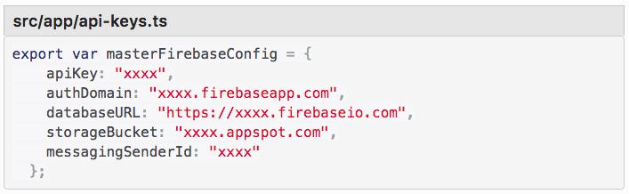

# HelloWorld: A Compendium Of Computer Programming Languages
## An application to list Programming Languages with sample code that generates "Hello World."

## To Run:
* Install the following:
    * [NPM](https://www.npmjs.com/)
    * [Angular CLI](https://cli.angular.io/) $ npm install -g @angular/cli@1.0.0
    * [Bower](https://bower.io/)
* Clone this repository from [Git Hub](https://github.com/likewater/hello-world.git)
* Create a DB using Firebase:
    * [Firebase](https://firebase.google.com/)
    * Name your Firebase DB: "languages"
    * Import the JSON file: sample-programs.json into your DB
    * Choose the option "for web" and Firebase will create a key
* In hello-world create a file: src/app/api-keys.ts
* Install your DB info as required:

* Run `ng serve` for a dev server. Navigate to `http://localhost:4200/`. The app will automatically reload if you change any of the source files.

## Code scaffolding

Run `ng generate component component-name` to generate a new component. You can also use `ng generate directive/pipe/service/class/module`.

## Build

Run `ng build` to build the project. The build artifacts will be stored in the `dist/` directory. Use the `-prod` flag for a production build.

## Running unit tests

Run `ng test` to execute the unit tests via [Karma](https://karma-runner.github.io).

## Running end-to-end tests

Run `ng e2e` to execute the end-to-end tests via [Protractor](http://www.protractortest.org/).
Before running the tests make sure you are serving the app via `ng serve`.

## Further help

This project was generated with [Angular CLI](https://github.com/angular/angular-cli) version 1.0.0.

To get more help on the Angular CLI use `ng help` or go check out the [Angular CLI README](https://github.com/angular/angular-cli/blob/master/README.md).

### License

This project is licensed under the MIT License - [license]

Permission is hereby granted, free of charge, to any person obtaining a copy of this software and associated documentation files (the "Software"), to deal in the Software without restriction, including without limitation the rights to use, copy, modify, merge, publish, distribute, sublicense, and/or sell copies of the Software, and to permit persons to whom the Software is furnished to do so, subject to the following conditions:

The above copyright notice and this permission notice shall be included in all copies or substantial portions of the Software.

THE SOFTWARE IS PROVIDED "AS IS", WITHOUT WARRANTY OF ANY KIND, EXPRESS OR IMPLIED, INCLUDING BUT NOT LIMITED TO THE WARRANTIES OF MERCHANTABILITY, FITNESS FOR A PARTICULAR PURPOSE AND NONINFRINGEMENT. IN NO EVENT SHALL THE AUTHORS OR COPYRIGHT HOLDERS BE LIABLE FOR ANY CLAIM, DAMAGES OR OTHER LIABILITY, WHETHER IN AN ACTION OF CONTRACT, TORT OR OTHERWISE, ARISING FROM, OUT OF OR IN CONNECTION WITH THE

Copyright (c) 2017

[license]: https://opensource.org/licenses/MIT
